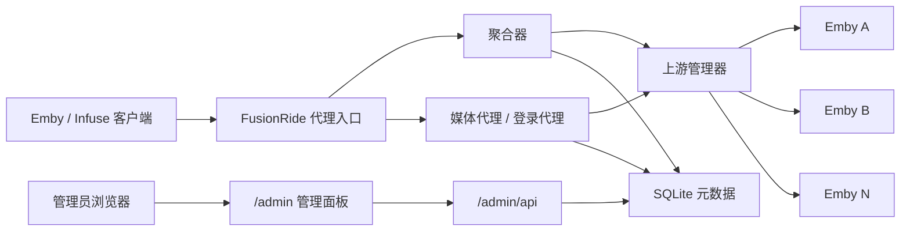

# FusionRide

FusionRide 是一个面向 Emby 的多上游聚合反向代理，负责把多个上游实例聚合为一个统一入口，对外提供登录代理、媒体列表聚合、流媒体转发、管理面板和健康检查。

## 架构



## 项目结构

- `cmd/fusionride`: 主程序入口
- `internal/server`: HTTP 服务与路由
- `internal/proxy`: Emby API 代理与流媒体处理
- `internal/aggregator`: 多上游聚合与去重
- `internal/upstream`: 上游管理、健康检查、认证
- `internal/config`: 配置读写与默认值
- `internal/db`: SQLite 初始化与迁移
- `web`: 管理面板静态资源

## 本地运行

要求：

- Go 1.22+
- 无需 CGO

构建：

```bash
go build -o fusionride ./cmd/fusionride
```

启动：

```bash
./fusionride
```

常用参数：

- `-config`
  默认 `config/config.yaml`
- `-data-dir`
  默认 `data/`
- `-version`
  输出版本信息后退出
- `-db`
  已废弃，兼容旧用法
- `-port`
  已废弃，兼容旧用法

首次启动时，如果 `config/config.yaml` 不存在，程序会自动生成默认配置文件。

## Docker Compose

```yaml
services:
  fusionride:
    build: .
    container_name: fusionride
    restart: unless-stopped
    ports:
      - "8096:8096"
    volumes:
      - fusionride-data:/app/data
      - fusionride-config:/app/config
    environment:
      - TZ=Asia/Shanghai

volumes:
  fusionride-data:
  fusionride-config:
```

说明：

- 镜像不会内置 `config.yaml`
- 容器首次启动时会自动在挂载目录下生成默认配置
- 健康检查地址为 `GET /health`

## 配置参考

可参考 [`config/config.yaml.example`](config/config.yaml.example)。

| 配置项 | 说明 | 默认值 |
| --- | --- | --- |
| `server.port` | HTTP 监听端口 | `8096` |
| `server.name` | 对外显示的服务名 | `FusionRide` |
| `server.id` | 聚合后的虚拟服务器 ID | `fusionride` |
| `admin.username` | 管理员用户名 | `admin` |
| `playback.mode` | 全局播放模式，`proxy` 或 `redirect` | `proxy` |
| `timeouts.api` | 普通 API 请求超时（毫秒） | `30000` |
| `timeouts.aggregate` | 聚合请求总超时（毫秒） | `15000` |
| `timeouts.login` | 登录请求超时（毫秒） | `10000` |
| `timeouts.healthCheck` | 单次健康检查超时（毫秒） | `10000` |
| `timeouts.healthInterval` | 健康检查轮询间隔（毫秒） | `60000` |
| `bitrate.preferHighest` | 是否优先高码率媒体源 | `true` |
| `bitrate.codecPriority` | 编解码器优先级列表 | `["hevc","av1","h264"]` |
| `upstream[].name` | 上游名称 | 必填 |
| `upstream[].url` | 上游 Emby 地址 | 必填 |
| `upstream[].username` / `password` | 上游用户名密码 | 可选 |
| `upstream[].apiKey` | 上游 API Key | 可选 |
| `upstream[].playbackMode` | 单上游播放模式 | 继承全局 |
| `upstream[].streamingUrl` | 直连流地址 | 空 |
| `upstream[].spoofClient` | 客户端伪装模式 | `infuse` |
| `upstream[].priorityMetadata` | 是否优先该上游元数据 | `false` |
| `upstream[].followRedirects` | 是否跟随上游重定向 | `true` |

## 管理面板与接口

- 管理面板：`http://127.0.0.1:8096/admin/`
- 健康检查：`http://127.0.0.1:8096/health`
- 代理入口：`http://127.0.0.1:8096`

## 故障排查

### 启动后无法访问 `/admin`

- 确认端口是否被占用
- 检查 `data/fusionride.log`
- 确认 `server.port` 配置是否与实际访问端口一致

### `/health` 返回上游数量为 0

- 说明当前还没有可用上游，或上游尚未认证成功
- 检查管理面板中上游状态
- 检查上游地址、账号或 API Key 是否正确

### 客户端登录失败

- 确认上游服务在线
- 确认 FusionRide 与上游之间网络连通
- 如果使用 API Key，确认 Key 可访问 Emby API

### 流媒体播放中断

- `proxy` 模式下确认客户端到 FusionRide 的连接稳定
- `redirect` 模式下确认客户端能直接访问 `streamingUrl` 或上游地址
- 查看日志中是否有超时、连接中断或上游返回错误

### Docker 启动后没有配置文件

- 确认 `./config` 或卷挂载目录可写
- 删除残留空目录后重新启动容器
- 观察容器日志，确认程序是否输出“已生成默认配置”

## 验证

建议每次改动后执行：

```bash
go mod tidy
go test ./...
go vet ./...
go build ./cmd/fusionride
```

## License

MIT，见 [`LICENSE`](LICENSE)。
